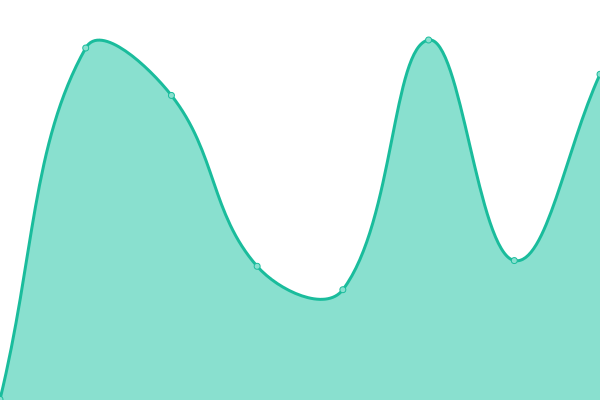
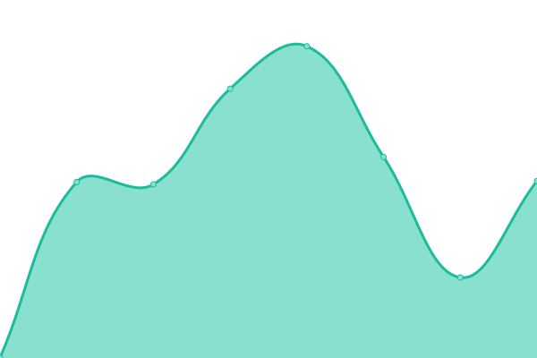

# [📈 Live Status](https://upptime.github.io/upptime): <!--live status--> **🟩 All systems operational**

This repository contains the open-source uptime monitor and status page for [Upptime](https://upptime.js.org), powered by [Upptime](https://github.com/upptime/upptime).

With [Upptime](https://upptime.js.org), you can get your own unlimited and free uptime monitor and status page, powered entirely by a GitHub repository. We use [Issues](https://github.com/upptime/upptime/issues) as incident reports, [Actions](https://github.com/builtview/status-page/actions) as uptime monitors, and [Pages](https://upptime.github.io/upptime) for the status page.

<!--start: status pages-->
<!-- This summary is generated by Upptime (https://github.com/upptime/upptime) -->
<!-- Do not edit this manually, your changes will be overwritten -->
<!-- prettier-ignore -->
| URL | Status | History | Response Time | Uptime |
| --- | ------ | ------- | ------------- | ------ |
|  [Website](https://builtview.com) | 🟩 Up | [website.yml](https://github.com/builtview/status-page/commits/HEAD/history/website.yml) | 

 348ms
     
 | 

<a href="https://builtview.github.io/status-page/history/website">100.00%</a>
    

|  [Web app](https://app.builtview.com) | 🟩 Up | [web-app.yml](https://github.com/builtview/status-page/commits/HEAD/history/web-app.yml) | 

 196ms
     
 | 

<a href="https://builtview.github.io/status-page/history/web-app">100.00%</a>
    

|  [Backend server](https://api.builtview.com/api/ping) | 🟩 Up | [backend-server.yml](https://github.com/builtview/status-page/commits/HEAD/history/backend-server.yml) | 

 1004ms
     
 | 

<a href="https://builtview.github.io/status-page/history/backend-server">100.00%</a>
    

|  [Authentication](https://builtview.b2clogin.com/builtview.onmicrosoft.com/v2.0/.well-known/openid-configuration?p=B2C_1A_SIGNUP_SIGNIN) | 🟩 Up | [authentication.yml](https://github.com/builtview/status-page/commits/HEAD/history/authentication.yml) | 

 1224ms
     
 | 

<a href="https://builtview.github.io/status-page/history/authentication">100.00%</a>
    

|  Image service | 🟩 Up | [image-service.yml](https://github.com/builtview/status-page/commits/HEAD/history/image-service.yml) | 

 759ms
     
 | 

<a href="https://builtview.github.io/status-page/history/image-service">100.00%</a>
    

|  Mapping service | 🟩 Up | [mapping-service.yml](https://github.com/builtview/status-page/commits/HEAD/history/mapping-service.yml) | 

 772ms
     
 | 

<a href="https://builtview.github.io/status-page/history/mapping-service">100.00%</a>
    

|  Export service | 🟩 Up | [export-service.yml](https://github.com/builtview/status-page/commits/HEAD/history/export-service.yml) | 

 758ms
     
 | 

<a href="https://builtview.github.io/status-page/history/export-service">100.00%</a>
    

|  AI Service | 🟩 Up | [ai-service.yml](https://github.com/builtview/status-page/commits/HEAD/history/ai-service.yml) | 

 757ms
     
 | 

<a href="https://builtview.github.io/status-page/history/ai-service">100.00%</a>
    

|  Integration service | 🟩 Up | [integration-service.yml](https://github.com/builtview/status-page/commits/HEAD/history/integration-service.yml) | 

 759ms
     
 | 

<a href="https://builtview.github.io/status-page/history/integration-service">100.00%</a>
    

<!--end: status pages-->

[**Visit our status website →**](https://upptime.github.io/upptime)

## 📄 License

- Powered by: [Upptime](https://github.com/upptime/upptime)
- Code: [MIT](./LICENSE) © [Upptime](https://upptime.js.org)
- Data in the `./history` directory: [Open Database License](https://opendatacommons.org/licenses/odbl/1-0/)
